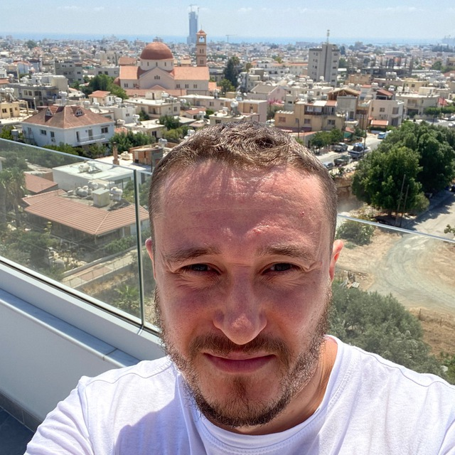

  +7 (927) 771-67-93  
  sawrus@gmail.com  
  37 лет, Тольятти  
  Обновлено: 16.08.2026 | [English](https://raw.githack.com/sawrus/evgeny_isaev_resume/main/resume.html)  

# Director of Engineering / Head of Engineering / CTO

## Профессиональный профиль

Руководитель разработки с 16-летним опытом в IT и более чем 10-летним опытом управления инженерными командами и технологическими проектами. Руководил подразделениями численностью до 90 человек, включая распределённые международные команды.

Специализируюсь на развитии высоконагруженных fintech-, antifraud- и data-intensive систем, инженерных платформ и критичной production-инфраструктуры. Выстраиваю инженерную функцию целиком: технологическая стратегия, архитектура, организационная структура, ресурсное планирование, найм и развитие сотрудников, SDLC, эксплуатационная надёжность и управление техническим долгом.

Сохраняю техническую глубину в Python, PostgreSQL, Kafka, Kubernetes и распределённых системах. Перевожу сложные технические задачи в измеримые результаты: ускорение обработки данных, сокращение time-to-market, повышение надёжности и снижение операционной нагрузки.

## Ключевая экспертиза

* управление инженерными подразделениями численностью до 90 человек
* управление разработчиками, QA, DevOps, аналитиками и техническими руководителями
* технологическая стратегия и развитие инженерных платформ
* организационный дизайн, формирование и развитие команд
* архитектура высоконагруженных и распределённых систем
* fintech, antifraud, BSS/OSS и data platforms
* ресурсное планирование, бюджетирование и управление рисками
* SDLC, CI/CD, observability и production reliability
* управление производительностью и техническим долгом
* внедрение AI coding agents и локальных LLM в SDLC

## Опыт работы

### Компания скрыта по NDA

**Руководитель разработки, апрель 2024 — настоящее время**

Основной продукт — Antifraud Platform: высоконагруженная платформа принятия решений для выявления и предотвращения мошенничества.

**Зона ответственности:**

* определение технологической стратегии и целевой архитектуры Antifraud Platform
* управление направлениями Backend, Frontend, DevOps и QA
* формирование команды, ресурсное планирование и развитие сотрудников
* развитие сервисов принятия решений, Rule Engine, ML-компонентов и операционных инструментов
* проектирование высоконагруженных микросервисов и платформенных компонентов
* унификация технологического стека и инженерных стандартов продуктовых команд
* развитие SDLC, CI/CD, мониторинга и процессов эксплуатации
* обеспечение отказоустойчивости, масштабируемости и производительности систем
* проведение архитектурных ревью и технологического R&D
* взаимодействие с бизнес-заказчиками, аналитиками и смежными инфраструктурными подразделениями

**Ключевые результаты:**

* инициировал создание единой Antifraud Platform: разработал целевую архитектуру, определил технологический стек и план объединения разрозненных antifraud-сервисов
* вывел в промышленную эксплуатацию процесс автоматического одобрения выплат
* ускорил расчёт связей между аккаунтами с 10 секунд до 120 мс по P95 — более чем в 80 раз
* вывел в промышленную эксплуатацию ML-модели предварительной оценки операций
* внедрил Rule Engine и инструменты самообслуживания, с помощью которых аналитики самостоятельно запустили более 300 antifraud-правил
* сократил time-to-market новых antifraud-правил с нескольких дней до нескольких часов
* сформировал с нуля команду разработки численностью более 10 специалистов
* построил изолированную инженерную инфраструктуру на базе Kubernetes, GitLab CI/CD и принципов Zero Trust
* спроектировал и запустил единую платформу операционных данных объёмом в десятки терабайт
* унифицировал технологический стек, процессы разработки и инженерные стандарты нескольких продуктовых команд
* организовал комплексный мониторинг сервисов, инфраструктурных зависимостей и бизнес-процессов на базе Prometheus, Grafana и Elasticsearch
* начал внедрение AI coding agents, MCP и локальных LLM в процессы разработки и инженерного R&D

**Технологии:** Python, Rust, FastAPI, Flask, JavaScript, PostgreSQL, Redis, ClickHouse, Elasticsearch, Kafka, Kubernetes, Docker, Temporal, GoRules, GitLab CI/CD, Prometheus, Grafana, S3/MinIO, AI/ML.

### Тензор

**Руководитель отдела разработки, ноябрь 2022 — апрель 2024**

Отвечал за развитие СБИС Карт для России и стран СНГ, включая сервисы почтовых адресов, определения местоположения по IP, построения маршрутов доставки и определения часовых зон.

**Зона ответственности:**

* управление командой разработки численностью более 10 человек
* формирование продуктового и технического roadmap
* ресурсное планирование, найм, обучение и аттестация сотрудников
* планирование и управление бюджетом
* проектирование архитектуры сервисов с нагрузкой более 1 000 RPS
* развитие процессов разработки, QA и CI/CD
* проектирование интеграций с Яндексом, OpenStreetMap и 2ГИС
* управление производительностью, качеством и инфраструктурой продуктов
* технологический R&D

**Ключевые результаты:**

* ускорил обновление данных из реестра ФНС с трёх суток до шести часов
* обеспечил обновление картографических данных без остановки сервисов и при сохранении рабочей нагрузки
* сократил цикл проверки изменений за счёт создания тестовых баз для быстрых экспериментов и нагрузочного тестирования
* организовал применение NLP-модели для анализа и очистки текстовых данных на картах России и СНГ
* переформировал и усилил команду: нанял четырёх разработчиков
* запустил процесс аттестации и профессионального развития сотрудников; два инженера получили повышение

**Технологии:** JavaScript, TypeScript, React, Node.js, C++, Python, PostgreSQL, Redis, Elasticsearch, ClickHouse, Kotlin, Swift, Kubernetes, GitLab CI/CD.

### LATOKEN

**Технический лидер / Архитектор HR-платформы, июль 2021 — октябрь 2022**

Подчинение генеральному директору. Отвечал за создание внутренней HR-платформы, автоматизирующей найм, управление сотрудниками, KPI/OKR, документооборот и бюджетирование.

**Зона ответственности:**

* формирование продуктовой и технической стратегии HR-платформы
* управление командой из 25 человек: разработчики, QA, DevOps, техническая поддержка и project management
* формирование roadmap и управление требованиями внутренних заказчиков
* проектирование архитектуры платформы и внешних интеграций
* планирование и управление бюджетом
* создание процессов разработки, тестирования и DevOps
* управление производительностью и качеством продукта

**Ключевые результаты:**

* сформировал команду практически с нуля и выстроил процессы разработки, тестирования и эксплуатации
* создал единую платформу управления жизненным циклом сотрудников — от найма до увольнения
* автоматизировал кадровый документооборот с использованием электронной подписи
* запустил модуль контроля и квартального прогнозирования бюджета на сотрудников
* создал автоматизированного бота для найма — от обработки резюме до формирования оффера; через систему выдано 3 300 офферов
* стандартизировал UI-компоненты для desktop-, mobile- и tablet-интерфейсов

**Технологии:** React, JavaScript, Python, Django, PostgreSQL, Kubernetes, GitLab CI/CD.

### Аутсорсинг разработки

**Технический директор, сентябрь 2019 — октябрь 2022**

Создал и развивал собственное направление заказной разработки программного обеспечения.

**Зона ответственности:**

* формирование команды разработчиков, тестировщиков и аналитиков
* продажи, пресейл и работа с заказчиками
* формирование продуктовой и технической стратегии проектов
* управление разработкой, бюджетом и юридическими вопросами
* архитектура web- и mobile-решений
* эксплуатация и мониторинг Kubernetes-кластеров
* контроль сроков, качества и финансового результата проектов

**Ключевые проекты:**

* **Иркутская нефтяная компания:** мобильный корпоративный мессенджер для защищённого обмена данными, рассчитанный более чем на 8 000 пользователей; разработал архитектуру передачи данных на базе NATS и QUIC
* **Опека Групп:** мобильное приложение и серверная платформа для контроля работы сотрудников и расчёта сдельной заработной платы
* **Поставщик Леруа Мерлен:** мобильный каталог продукции и технической документации с поиском по наименованиям и артикулам

**Технологии:** Dart, Flutter, JavaScript, Python, Django, Flask, Celery, PostgreSQL, MySQL, Redis, Kubernetes, Docker, GitLab CI/CD, NGINX, NATS, QUIC, Camunda BPM.

### Netcracker Technology

**Главный Project Manager / Project Manager / Технический менеджер / Старший Java-разработчик, сентябрь 2010 — январь 2021**

За десять лет прошёл путь от Java-разработчика до главного руководителя группы международных телеком-проектов и заместителя VP.

**Telenet, 2020–2021 — главный Project Manager, заместитель VP**

* стратегическое планирование группы проектов телеком-оператора
* координация десяти технических менеджеров
* финансовое и ресурсное управление подразделением численностью 90 человек
* участие в отчётных и стратегических встречах топ-менеджмента Netcracker

**Turkcell, 2019–2020 — Project Manager, заместитель Project Director**

* управление группой проектов и контрактными обязательствами
* разработка roadmap, управление рисками, сроками и финансами
* планирование полного жизненного цикла проектов — от инициации до промышленного запуска
* проведение рабочих встреч с топ-менеджментом заказчика в Стамбуле

**Colt Technology Services, 2016–2019 — технический менеджер**

* координация распределённых команд в пяти часовых поясах
* ресурсное планирование команды из 20 инженеров
* управление четырьмя направлениями разработки
* сбор требований и проектирование архитектуры BSS/OSS-решений
* организация промышленной поддержки и передачи решений в эксплуатацию
* участие в архитектурных сессиях международной группы в Барселоне

**Swisscom, 2012–2016 — старший Java-разработчик / Team Lead**

* техническое руководство проектом оптимизации Oracle Database объёмом 3 ТБ
* оптимизация PL/SQL и процессов установки production-патчей для распределённой базы из восьми узлов
* руководство проектом повышения скорости передачи данных по телекоммуникационным сетям
* проектирование архитектуры резервных сетевых маршрутов
* проведение code review и техническое руководство группой из семи разработчиков

**Maxis, 2010–2012 — Java-разработчик**

* автоматизация настройки сетевого оборудования для подключения абонентов
* разработка модулей диагностики и проверки связи сетевых устройств

**Технологии:** Java EE, Oracle, PL/SQL, PostgreSQL, BSS/OSS, распределённые системы, телекоммуникационные сети.

### KSI

**C++ Game Developer, сентябрь 2009 — сентябрь 2010**

* разработка 2D-игр на C++
* создание тестов производительности математического модуля
* синхронизация потоков графики и аудио

## Технологическая экспертиза

**Архитектура:** highload, distributed systems, event-driven architecture, microservices, data platforms, fault tolerance, observability.

**Backend и данные:** Python, FastAPI, Flask, Django, Rust, Java, C++, PostgreSQL, Oracle, ClickHouse, Redis, Elasticsearch.

**Инфраструктура:** Kubernetes, Docker, GitLab CI/CD, Prometheus, Grafana, S3/MinIO, NGINX, Linux.

**Интеграции и обработка событий:** Kafka, Temporal, Celery, NATS, QUIC, REST API.

**AI engineering:** AI coding agents, Codex, MCP, Ollama, локальные LLM, внедрение AI-инструментов в SDLC.

## Управленческая экспертиза

* технологическая стратегия
* управление руководителями и распределёнными командами
* организационный дизайн
* ресурсное планирование и бюджетирование
* найм, адаптация и развитие сотрудников
* управление roadmap и портфелем проектов
* управление рисками и техническим долгом
* Agile, Scrum, Lean
* работа с C-level и внутренними заказчиками
* управление международными проектами

## Проекты

* [Agent Guides](https://github.com/sawrus/agent-guides) — практическое руководство по использованию команд AI-агентов на этапах SDLC
* [Мобильные сотрудники](https://sbis.ru/mobile_workers) — продукт СБИС для организации работы выездных сотрудников
* [LATOKEN Hiring Bot](https://t.me/LATOKEN_hiring_bot) — автоматизация процесса найма сотрудников

## Образование

**Тольяттинский государственный университет, 2010**

Институт математики, физики и информационных технологий  
Математическое обеспечение и администрирование информационных систем

## Дополнительное образование

**Сбербанк, 2019**

Построение бизнес-моделей и исследование рынка

## Языки

* Русский — родной
* Английский — B2, опыт проведения рабочих встреч и взаимодействия с международными заказчиками
